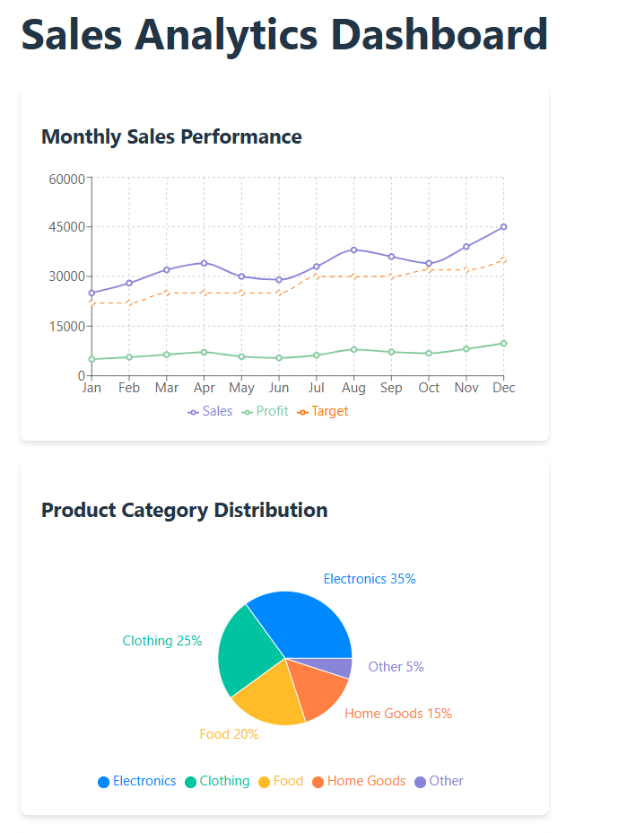
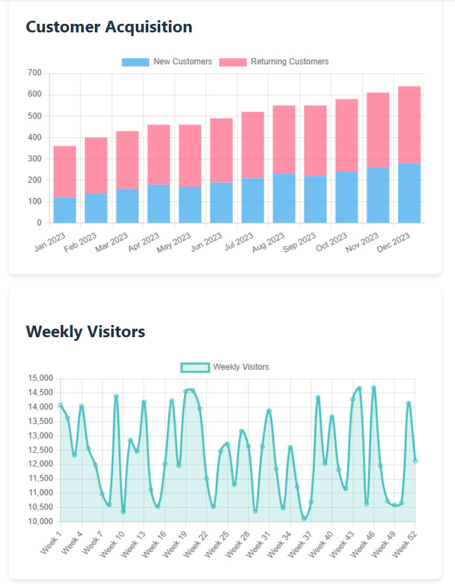

# Data Visualization Dashboard using React

## Overview

This project is a hands-on implementation of charting libraries in React to create an interactive analytics dashboard. Through this practical, you'll learn how to:

- Set up and use different charting libraries in a React app
- Create various chart types (line, pie, bar, area)
- Make charts responsive and interactive
- Load and transform data for visualization
- Optimize charts for performance


## Setup Instructions

### 1. Clone the Starter Repository

Start by cloning the pre-configured setup:

```bash
git clone https://github.com/syangche/Data-Visualisation.git
cd Data-Visualisation
````

### 2. Install Dependencies

Make sure all necessary packages are installed:

```bash
npm install
```

If you encounter `'vite' is not recognized`, install it locally:

```bash
npm install --save-dev vite
```

---

## Chart Components Implementation

Create the following components inside the `components/` folder.

### 1. **Monthly Sales Chart** (`Line Chart` using `Recharts`)

* File: `components/MonthlySalesChart.jsx`
* Displays monthly sales trends with a responsive line chart.

### 2. **Product Category Chart** (`Pie Chart` using `Recharts`)

* File: `components/ProductCategoryChart.jsx`
* Visualizes product category distribution in a pie chart format.

### 3. **Customer Acquisition Chart** (`Bar Chart` using `react-chartjs-2`)

* File: `components/CustomerAcquisitionChart.jsx`
* Shows customer acquisition metrics in a bar chart.

### 4. **Weekly Visitors Chart** (`Area Chart` using `react-chartjs-2`)

* File: `components/WeeklyVisitorsChart.jsx`
* Renders visitor trends across the week using an area chart.

Use responsive and interactive options to enhance user experience. For example:

```js
const options = {
  responsive: true,
  maintainAspectRatio: false,
  plugins: {
    legend: { position: 'top' },
    tooltip: {
      callbacks: {
        label: function(context) {
          let label = context.dataset.label || '';
          if (label) label += ': ';
          if (context.parsed.y !== null) {
            label += context.parsed.y.toLocaleString();
          }
          return label;
        }
      }
    }
  },
  scales: {
    y: {
      beginAtZero: false
    }
  }
};
```


## Final Integration

In `App.jsx`, import and include all the chart components to build the dashboard layout:

```jsx
import MonthlySalesChart from './components/MonthlySalesChart';
import ProductCategoryChart from './components/ProductCategoryChart';
import CustomerAcquisitionChart from './components/CustomerAcquisitionChart';
import WeeklyVisitorsChart from './components/WeeklyVisitorsChart';

// Add them into your JSX layout
```

---

## Run the Project

Start the development server:

```bash
npm run dev
```

Access the dashboard at:

```
http://localhost:5173/
```

---

## Folder Structure

```
Data_Visualization/
├── components/
│   ├── MonthlySalesChart.jsx
│   ├── ProductCategoryChart.jsx
│   ├── CustomerAcquisitionChart.jsx
│   └── WeeklyVisitorsChart.jsx
├── App.jsx
├── index.html
├── package.json
└── ...
```

---

## Notes

* Ensure you have the latest versions of `Recharts` and `react-chartjs-2`.
* Make your charts visually appealing and readable.
* Use mock or real data as required.

---

## Learning Outcome

By completing this practical, you will be comfortable using modern charting libraries in a React environment to build real-time, interactive dashboards.

## Screenshots





