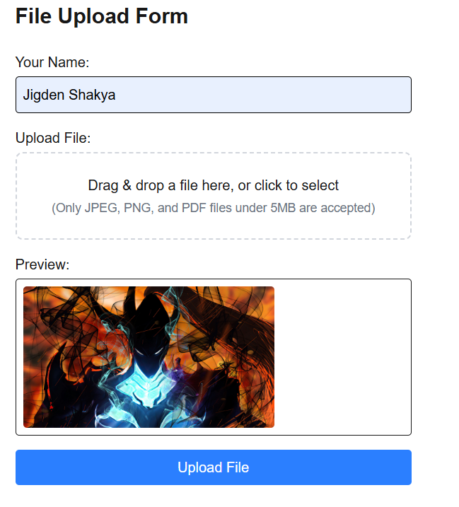
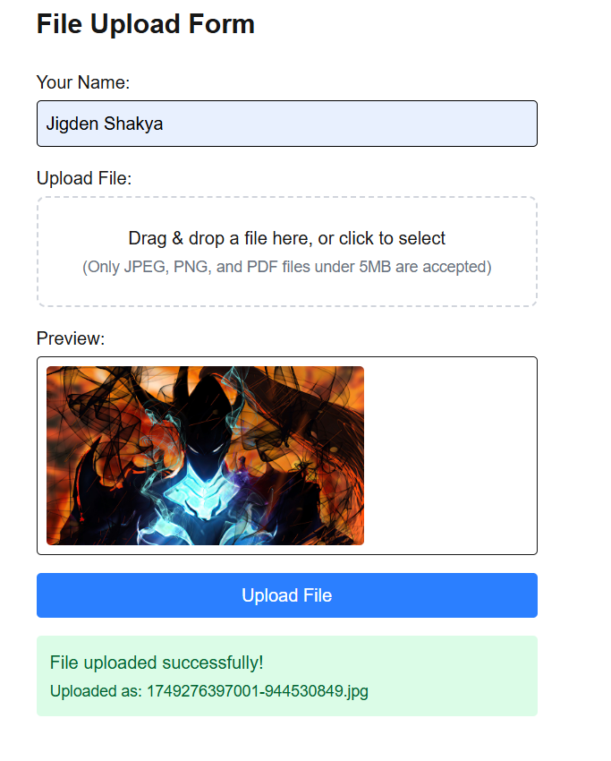
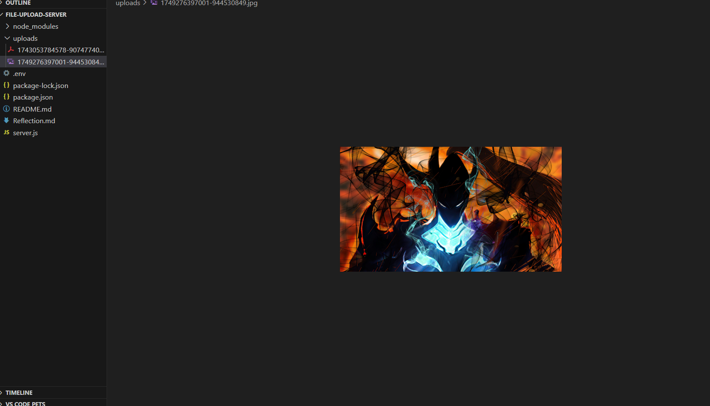

# File Upload App with Drag & Drop, Preview, and Progress Tracking

### Main Concepts Applied

In this practical, I applied the following core concepts:

1. **React and Next.js Fundamentals**  
   Utilized component-based architecture with functional components and hooks (`useState`, `useEffect`) in a Next.js app.

2. **File Upload Handling**  
   Implemented a file upload form that supports both traditional file selection and drag-and-drop using the `react-dropzone` library.

3. **Form Management**  
   Used `react-hook-form` to efficiently manage form inputs, validations, and submission states.

4. **Progress Tracking**  
   Integrated Axios to send `multipart/form-data` and track upload progress using the `onUploadProgress` callback.

5. **Client-Side Preview**  
   Displayed previews of selected files (especially images) using the `URL.createObjectURL()` method.

6. **Tailwind CSS Styling**  
   Customized the UI using utility-first styling from Tailwind CSS. Applied transitions, dark mode, and responsive layout adjustments.

7. **Server-Side Upload Processing**  
   On the backend, used `formidable` to parse incoming form data and save uploaded files. This required setting up a custom route handler in `src/app/api/upload/route.js`.

### What I Learned

- How to build a full-stack file upload system using Next.js and modern React libraries.
- Importance of handling different file states: selected, uploading, uploaded, and removed.
- How to dynamically update the UI based on form and upload state using hooks.
- Learned to work with `FormData` and configure it properly with Axios for file uploads.

### Challenges Faced

#### 1. **Drag & Drop Event Handling**
**Issue:** At first, the dropzone area wasn’t responding to dragged files.  
**Solution:** I learned that I needed to properly bind `onDragEnter`, `onDragLeave`, and `onDrop` events from `react-dropzone`, and ensure that styling changed dynamically using class toggles like `dropzone.active`.

**Screenshot:**  

---

#### 2. **File Preview Before Upload**
**Issue:** Images weren’t previewing properly before upload.  
**Solution:** I used `URL.createObjectURL(file)` to show a preview immediately after file selection.

**Screenshot:**  

---

#### 3. **Tracking Upload Progress**
**Issue:** Uploads appeared to freeze as there was no visible feedback.  
**Solution:** Axios’ `onUploadProgress` was used to visually track the progress with a styled progress bar.

**Screenshot:**  

---

### Final Thoughts

This practical helped me build confidence in managing file uploads in a real-world app. I appreciated how well the React ecosystem integrates with UI libraries and tools like Axios, Dropzone, and Tailwind CSS. I now feel more capable of building user-friendly and responsive interfaces that handle asynchronous processes like uploads.
