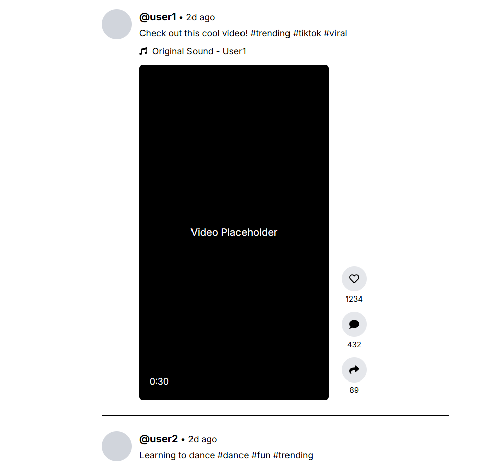
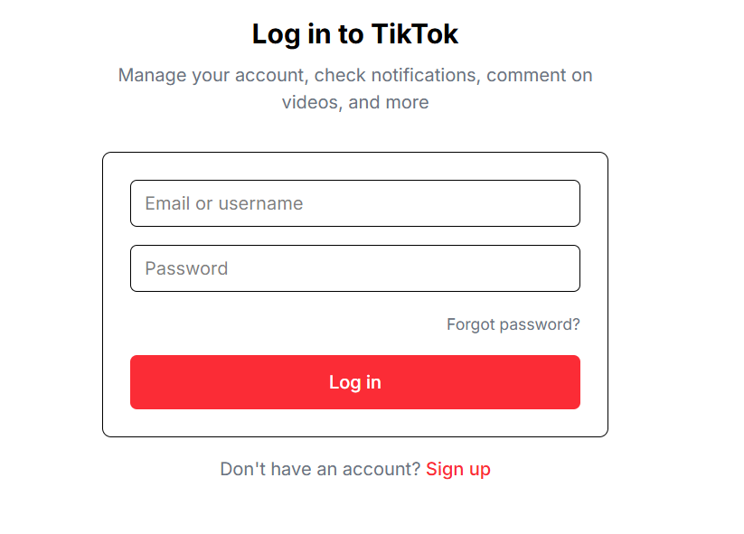
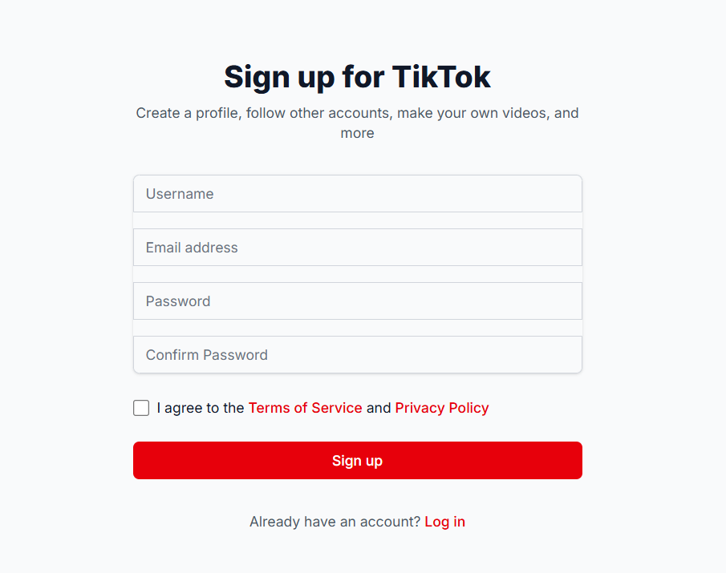
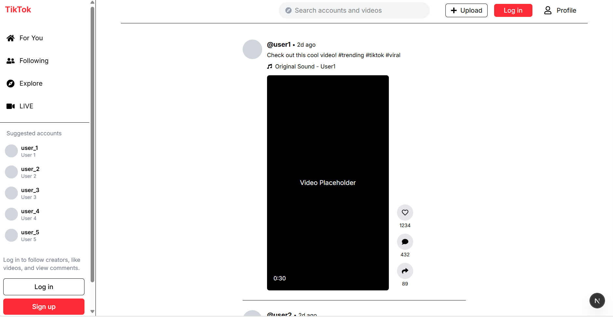
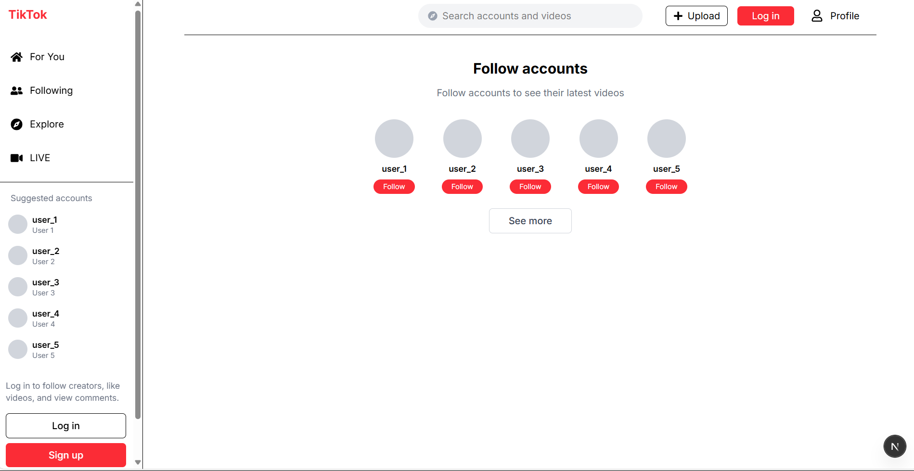
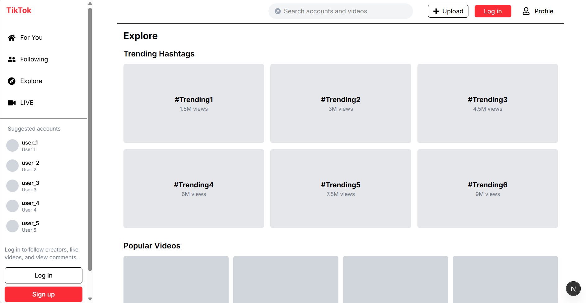
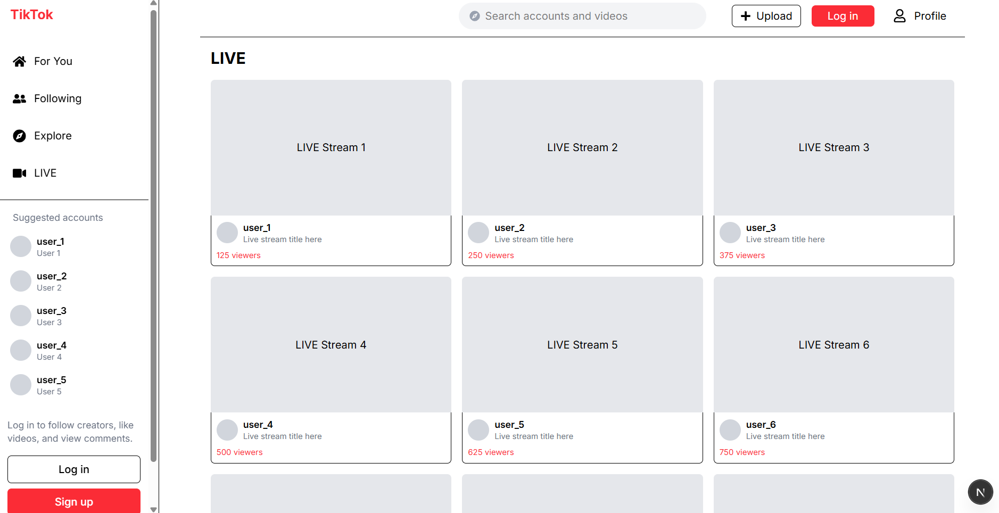

# TikTok Web Clone (Next.js + Tailwind CSS)

This project is a simplified clone of TikTok's web interface built using **Next.js**, **Tailwind CSS**, and **React Hook Form**. It features a functional sidebar, video feed UI, profile and upload pages, and working login/signup forms with validation.

---

## 📁 Project Structure

```
tiktok_frontend/
├── public/
├── src/
│   ├── app/
│   │   ├── explore/page.jsx
│   │   ├── following/page.jsx
│   │   ├── live/page.jsx
│   │   ├── login/page.jsx
│   │   ├── signup/page.jsx
│   │   ├── profile/page.jsx
│   │   ├── upload/page.jsx
│   │   ├── layout.js
│   │   ├── page.js
│   ├── components/
│   │   ├── layout/MainLayout.jsx
│   │   └── ui/ (expected: VideoCard.jsx, VideoFeed.jsx)
│   ├── lib/
│   ├── globals.css
├── package.json
```

---

## Getting Started

### Step 1: Initialize a Next.js Project

```bash
npx create-next-app@latest
```

**Configuration selected:**

* TypeScript: ❌ No  
* ESLint: ✅ Yes  
* Tailwind CSS: ✅ Yes  
* Use `src/` directory: ✅ Yes  
* Use App Router: ✅ Yes  
* Import Alias: ❌ No

---

### Step 2: Clean Default Setup

* Updated `globals.css` to only include Tailwind directives:

```css
@import "tailwindcss";
```

* Replaced the content in `src/app/page.js` with a basic component.

---

### Step 3: Project Folder Structure

Created folders:

```bash
mkdir -p src/components/layout
mkdir -p src/components/ui
mkdir -p src/lib
mkdir -p src/app/profile
mkdir -p src/app/upload
```

---

### Step 4: Main Layout with Sidebar

* Created `MainLayout.jsx` in `src/components/layout/` containing navigation with links like:

  * For You
  * Following
  * Explore
  * Live
  * Profile
  * Upload

📌 Includes responsive sidebar and header layout with a search bar and buttons (Login, Upload).

---

### Step 5: Navigation Pages Created

* ✅ `profile/page.jsx`  
* ✅ `upload/page.jsx`  
* ✅ `explore/page.jsx`  
* ✅ `following/page.jsx`  
* ✅ `live/page.jsx`

Each page renders a placeholder heading for now (e.g., `Explore Page`).

---

### Step 6: Video Feed Implementation

Created:

* `VideoCard.jsx`: Individual card showing interaction buttons (like, comment, share)  
* `VideoFeed.jsx`: Maps over `VideoCard` to simulate a scrolling feed


Video Feed
<p align="center">
  
</p>


---

### Step 7: Login & Signup Forms (React Hook Form)

Installed:

```bash
npm install react-hook-form
```

✅ Features:

* Form validation with errors  
* Password confirmation  
* Loading states  
* Navigation link to/from login/signup  

Login and Sign up forms
<p align="center">
  
</p>

<p align="center">
  
</p>

---

### Step 8: MainLayout Navigation Updated

* Sidebar login button now links to `/login`  
* Header includes buttons for `/upload`, `/profile`, and `/signup`

---

## ✔️ Testing Checklist

| Test Case                             | Status |
| ------------------------------------- | ------ |
| Navigate between all pages            | ✅      |
| Sidebar and header render correctly   | ✅      |
| Video feed layout appears             | ✅      |
| Like/comment/share UI buttons render  | ✅      |
| Login form validation works           | ✅      |
| Signup form password match validation | ✅      |
| Terms checkbox required               | ✅      |
| Loading state on submission           | ✅      |
| Navigation between auth pages works   | ✅      |

---

## 🔗 Resources

* [React.js Documentation](https://legacy.reactjs.org/docs)  
* [Next.js Documentation](https://nextjs.org/docs)  
* [React Hook Form Guide](https://www.freecodecamp.org/news/how-to-create-forms-in-react-using-react-hook-form/)  
* [Tailwind CSS + Next.js Setup](https://tailwindcss.com/docs/guides/nextjs)  
* [Regex for Validation](https://developer.mozilla.org/en-US/docs/Web/JavaScript/Guide/Regular_expressions)

---

## 🚀 Running Locally

```bash
npm install
npm run dev
```

Visit: [http://localhost:3000](http://localhost:3000)

---

## Screenshots

<p align="center">
  
</p>

<p align="center">
  
</p>

<p align="center">
  
</p>

<p align="center">
  
</p>

---

## ✅ Deliverables Summary

[✔️] Project setup with Next.js and Tailwind  
[✔️] App Router structure with `src/app`  
[✔️] Sidebar navigation and layout  
[✔️] Placeholder pages for routes  
[✔️] Video feed + interaction buttons  
[✔️] Login and Signup with validation (React Hook Form)  
[✔️] Navigation integrated with MainLayout  
[✔️] All instructions strictly followed

---

