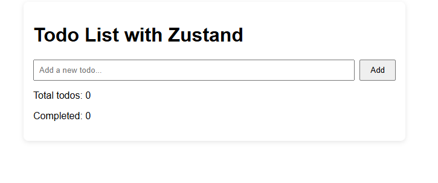
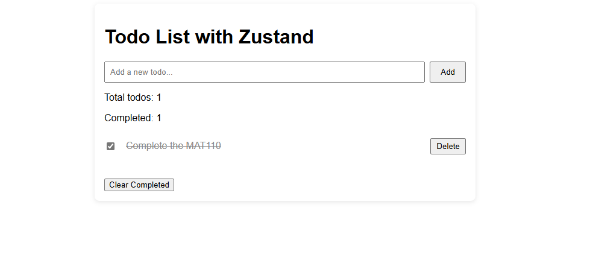

# Todo List Application with Zustand

This is a basic Todo List application built using **React** and **Zustand**. It demonstrates how to manage global state in a simple and efficient way without using prop drilling or Context API.

---

## Introduction

The goal of this project is to help you learn how Zustand works in a real-world example by building a fully functional todo list. You'll understand how to create a centralized store, manage state updates, and persist data using localStorage.


## Project Setup

1. Create a new React project using Vite:

```bash
npx create-vite@latest todo-zustand
cd todo-zustand
npm install
````

2. Install Zustand:

```bash
npm install zustand
```

---

## Folder Structure

Inside the `src` folder, use the following structure:

```
src/
├── components/
│   ├── TodoInput.jsx      # Component to add new todos
│   ├── TodoItem.jsx       # Component for each individual todo
│   └── TodoList.jsx       # Component to list all todos
├── store/
│   └── todoStore.js       # Zustand store for managing state
├── App.js                 # Main App component
└── main.jsx               # Entry point of the app
```

---

##  Components Overview

* **TodoInput**: This component allows users to type and add a new todo.
* **TodoItem**: This displays an individual todo and allows marking it as complete or deleting it.
* **TodoList**: This displays all the todos by mapping through the list from the store.

---

## App Component

The `App` component brings all parts together. It includes the input, list of todos, and a button to clear completed tasks.

---

## Adding Persistence

To ensure todos are saved even when the page reloads, persistence is added to the store using Zustand’s middleware. This stores the state in the browser's localStorage.


## Screenshots


