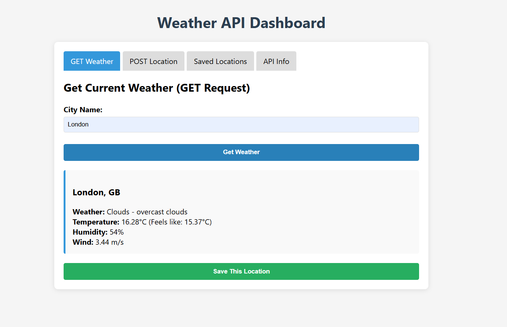
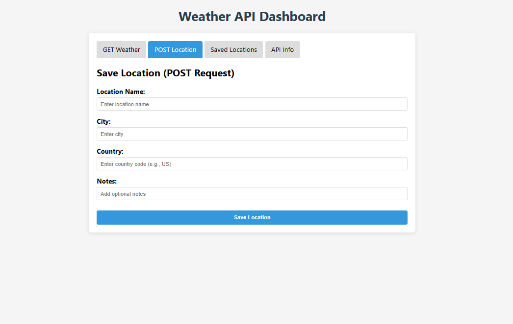
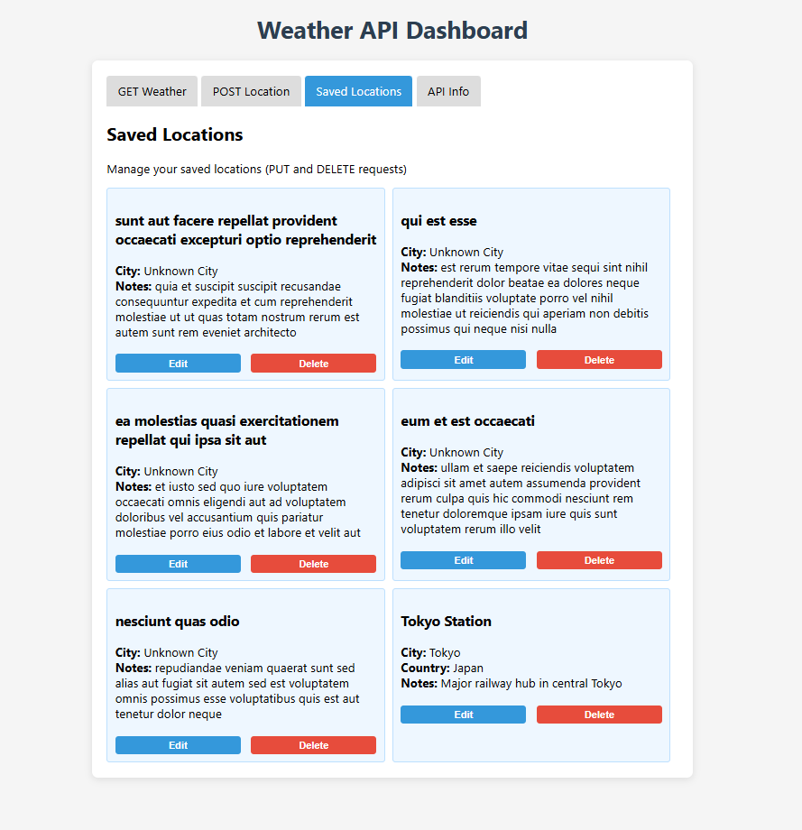
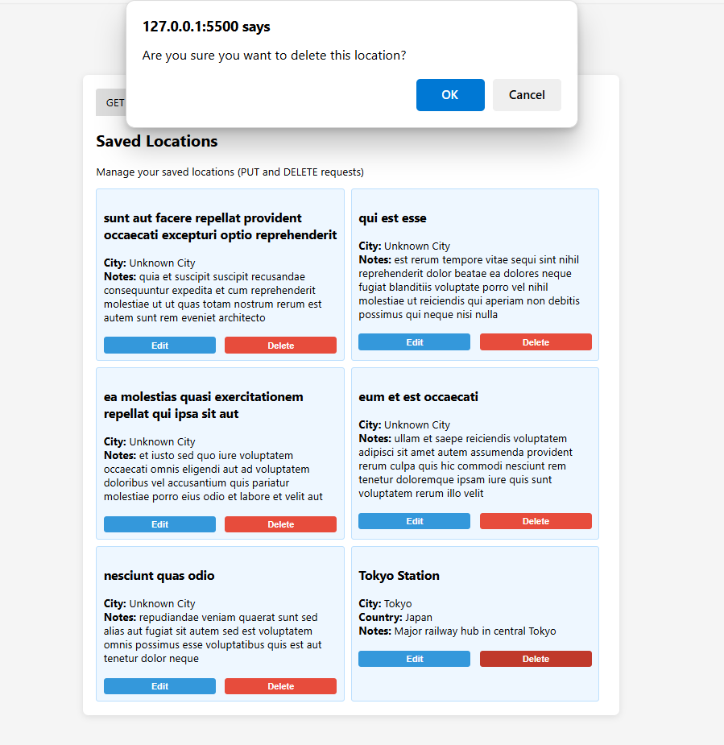

# 🌦️ RESTful Weather Application

A responsive web-based application that demonstrates how to use **GET**, **POST**, **PUT**, and **DELETE** requests with public REST APIs. It fetches real-time weather data using the **OpenWeatherMap API** and simulates CRUD operations for saved locations using **JSONPlaceholder**.


## 📁 Project Structure

```

/restful-weather-app
│
├── index.html         # Frontend UI with tabbed interface
├── script.js          # JavaScript logic for API calls and state management
├── images/            # Screenshots of test results for each API action
├── Reflection.md      # Summary of learnings and insights
└── README.md          # Project documentation (this file)

```


## Features

- **GET**: Retrieve weather information for any city using OpenWeatherMap API.
- **POST**: Save a new location (simulated via JSONPlaceholder).
- **PUT**: Update a saved location’s details.
- **DELETE**: Remove a saved location from the list.
- **Tabbed Interface**: Switch between GET, POST, Saved Locations, and API Info tabs.
- **Modal Dialog**: Inline editor for PUT operations.
- **User Feedback**: API responses displayed in a styled output section.

---

## 🔧 Setup Instructions

1. **Clone the repository or download the files**
   ```bash
   git clone https://github.com/your-username/restful-weather-app.git
   cd restful-weather-app


2. **Get an API Key from OpenWeatherMap**

   * Register at [https://openweathermap.org/api](https://openweathermap.org/api)
   * Navigate to API Keys and copy your personal key

3. **Add Your API Key**

   * In `script.js`, replace `'API Key'` with your key:

     ```js
     const WEATHER_API_KEY = 'your_actual_api_key_here';
     ```

4. **Run the App**

   * Open `index.html` in your browser. No server required.


## 🌐 API Operations

### 1. GET - Current Weather

* **Endpoint**: `https://api.openweathermap.org/data/2.5/weather`
* **Params**: `q=city&appid=YOUR_API_KEY`
* **Steps**:

  1. Enter a city name
  2. Click **Get Weather**
  3. View real-time weather info





### 2. POST - Save a Location

* **Endpoint**: `https://jsonplaceholder.typicode.com/posts`
* **Payload**:

  ```json
  {
    "title": "Location Name",
    "body": {
      "city": "City Name",
      "country": "Country Code"
    },
    "userId": 1
  }
  ```
* **Steps**:

  1. Fill in location details
  2. Click **Save Location**
  3. Location appears in Saved Locations





### 3. PUT - Edit a Saved Location

* **Endpoint**: `https://jsonplaceholder.typicode.com/posts/{id}`
* **Steps**:

  1. Click **Edit** on any saved item
  2. Modify values in the modal
  3. Click **Update**





### 4. DELETE - Remove a Location

* **Endpoint**: `https://jsonplaceholder.typicode.com/posts/{id}`
* **Steps**:

  1. Click **Delete** on any saved item
  2. Location is removed and DELETE is simulated





## App Flow Summary

1. User enters a city ➝ **GET request** ➝ Weather data displayed
2. User saves a new location ➝ **POST request** ➝ Location stored
3. User edits a location ➝ **PUT request** ➝ Data updated
4. User deletes a location ➝ **DELETE request** ➝ Entry removed


##  Learning Objectives

* Understand RESTful API interactions using JavaScript
* Practice CRUD operations via `fetch()` and public APIs
* Build responsive interfaces with HTML, CSS, and JS
* Use tab-based navigation for UI clarity
* Improve debugging and async programming skills


##  License

This project is released under the [MIT License](LICENSE).
API usage complies with [OpenWeatherMap Terms](https://openweathermap.org/terms).


## Acknowledgments

* [OpenWeatherMap](https://openweathermap.org/api) for weather data
* [JSONPlaceholder](https://jsonplaceholder.typicode.com/) for simulating REST operations


